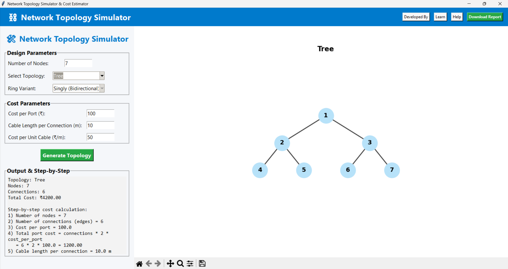

# 🖥️ Network Topology Simulator & Cost Estimator  

### 📚 Project Overview  
This Python-based **Network Topology Simulator** allows users to design and analyze various **network topologies** such as Bus, Star, Ring, Mesh, and Tree.  
It provides an **interactive GUI** built with Tkinter to visualize each topology, calculate the **total network cost**, and generate a **detailed report** including all parameters and results.

---

### ⚙️ Features  
✅ Generate and visualize topologies: **Bus, Star, Ring (3 variants), Mesh, Tree**  
✅ Automatic cost calculation (port + cable cost)  
✅ Step-by-step breakdown of total cost  
✅ Interactive graph view (zoom, pan, save)  
✅ Built-in **Learning Mode** – theory + video reference  
✅ “Developed By” credits section with images  
✅ Export detailed **Word report (DOCX)**  
✅ Smooth and clean **Tkinter GUI**  

---

### 🧩 Tech Stack  
- **Python 3.11+**  
- **Tkinter** – GUI Framework  
- **NetworkX** – Network graph creation  
- **Matplotlib** – Visualization  
- **Pillow (PIL)** – Image handling  
- **python-docx** – Report generation  
- **tkhtmlview** – Embedded content  

---

### 🖼️ Application Preview  



---

### 🧮 How It Works  

1. **Enter Inputs:**  
   - Number of nodes  
   - Select topology type  
   - (For Ring) choose variant  
   - Enter port cost, cable length, and cost per meter  

2. **Click “Generate Topology”**  
   - Visualizes your chosen topology  
   - Calculates total cost  
   - Displays step-by-step cost breakdown  

3. **Click “Download Report”**  
   - Exports results to a formatted **Word document**  

---

### 📄 Report Generation  
Each report includes:
- Input parameters  
- Step-by-step cost calculations  
- Topology diagram  
- List of all connections  
- Footer with project details  

---

### 🧑‍💻 Developed By  
- **Abijith Thennarasu (24BCE1626)**  
- **Dharmayu Jadwani**  
- Guided by **Dr. Swaminathan Annadurai**

---

### 🧠 Learning Mode  
Learn the concepts of each topology right inside the app with a detailed theoretical explanation and direct access to an animated YouTube tutorial:  
🎥 [Network Topology Explanation](https://www.youtube.com/watch?v=zbqrNg4C98U)

---

### 🚀 How to Run  

1. **Clone the repository**  
   ```bash
   git clone https://github.com/<your-username>/Network-Topology-Simulator.git
   cd Network-Topology-Simulator
   ```

2. **Install dependencies**  
   ```bash
   pip install -r requirements.txt
   ```

3. **Run the application**  
   ```bash
   python network_topology_gui.py
   ```

---

### 📦 Requirements  
If you face missing module errors, install these manually:
```bash
pip install networkx matplotlib pillow python-docx tkhtmlview
```

---

### 🧰 Folder Structure  
```
Network-Topology-Simulator/
│
├── network_topology_gui.py        # Main application code
├── computer.png                   # Node icon
├── professor.png                  # Professor image
├── abijith.jpeg                   # Developer image
├── dharmyu.jpeg                   # Developer image
├── requirements.txt               # Dependencies
├── screenshot.png                 # Application GUI image
├── README.md                      # Project documentation
└── report/                        # Sample Report
```

---

### 🏆 Credits  
> Developed as part of **Computer Networks (DA Project)**  
> **VIT Chennai**  
> Faculty Guide: *Dr. Swaminathan Annadurai*  

---

### 📬 Contact  
**Abijith Thennarasu**  
📧 abijith.thennarasu2024@vitstudent.ac.in  
📍 VIT Chennai  
